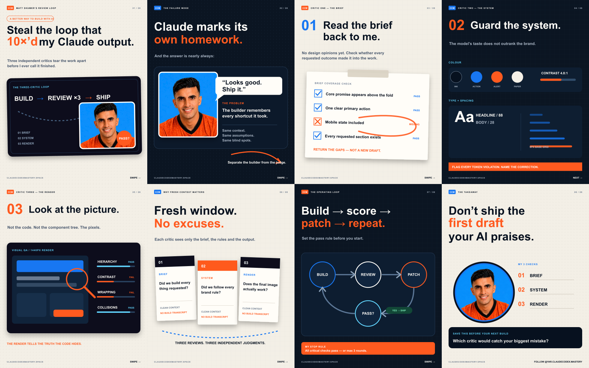
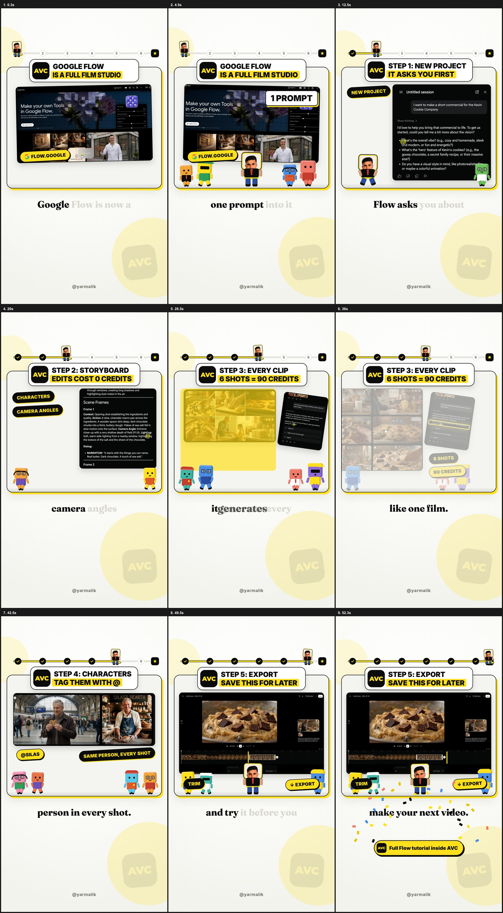
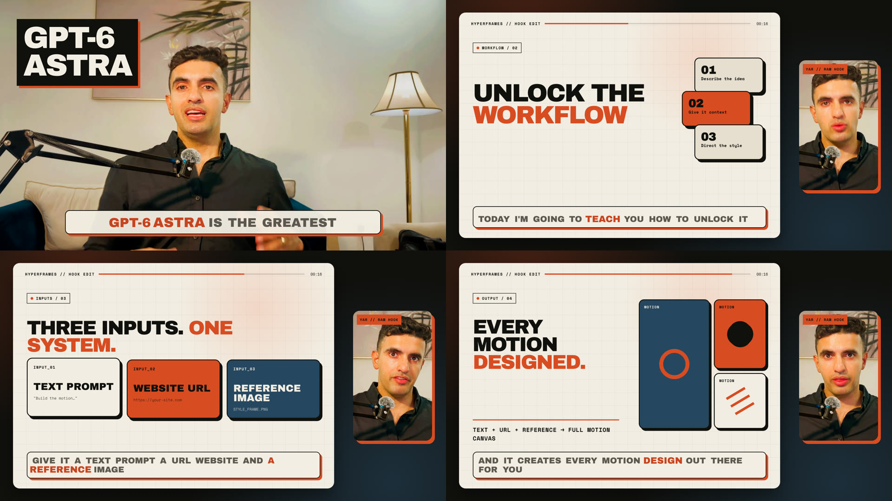

# HyperFrames video and social-content examples

Three complete, editable production examples.
Use this team repository as the reference for how a short, a long-video hook, and an Instagram carousel are structured, reviewed, rendered, and published.

| Example | Format | Watch | What it teaches |
| --- | --- | --- | --- |
| [Google Flow Short](#google-flow-short) | 1080×1920 | [YouTube Short](https://www.youtube.com/shorts/_YGFZe2RKVo) | A complete vertical short with six illustrated beats, voice timing, music, and captions. |
| [GPT-6 Astra long-video hook](#gpt-6-astra-long-video-hook) | 1920×1080 | [Before (raw)](https://drive.google.com/file/d/1C4yEdXUr6sSTA79I0i7gM4Sp5X937NXD/view?usp=sharing) → [After (edit)](https://youtu.be/6h9WkGRd9SU) | A raw talking-head hook that starts full-screen, then shrinks the presenter into a floating side card next to an animated visual canvas. |
| [Instagram carousel](#instagram-carousel) | 1080×1350 × 8 | [Published post](https://www.instagram.com/yar.claudecodex.mastery/p/DdDeqT8DlzZ/) | A reproducible editorial carousel with an avatar, editable SVG source, PNG exports, caption, references, and publishing checklist. |

## Instagram carousel



The [`examples/instagram-carousel/`](examples/instagram-carousel/) case study documents the complete process used to turn an Instagram creative reference into an original, personalized eight-slide carousel for `@yar.claudecodex.mastery`.

Start with:

- [`README.md`](examples/instagram-carousel/README.md) — full creation, review, adaptation, and Instagram upload workflow.
- [`DESIGN.md`](examples/instagram-carousel/DESIGN.md) — canvas, palette, typography, layout, and quality rules.
- [`REFERENCES.md`](examples/instagram-carousel/REFERENCES.md) — source links, attribution, and included assets.
- [`scripts/build.mjs`](examples/instagram-carousel/scripts/build.mjs) — editable SVG/PNG generator.
- [`output/`](examples/instagram-carousel/output/) — all eight upload-ready PNGs and editable SVGs.
- [`caption.txt`](examples/instagram-carousel/caption.txt) — published caption.

Rebuild all outputs from the repository root:

```bash
npm run build:carousel
```

## Google Flow Short



## Watch and study the example

- **Published Short:** [The secret to creating AI movies in minutes](https://www.youtube.com/shorts/_YGFZe2RKVo)
- **Local preview:** [`demo/google-flow-short-preview.mp4`](demo/google-flow-short-preview.mp4)
- **Editing inspiration:** [Alex / nocodealex — “Own a full AI agency for $0”](https://www.instagram.com/nocodealex/reel/Dc4cu6cySSA/)
- **Style notes:** [`EDITING_REFERENCE.md`](EDITING_REFERENCE.md) explains which editing patterns informed this example.

The Instagram reel is an editing reference only. It inspired the layout, pacing, progress rail, headline card, rounded visual stage, and word-by-word captions. It is not the factual source for the Google Flow script.

## Start here

Requirements: Node.js 22+, npm, FFmpeg, and Chrome.

```bash
git clone https://github.com/yar-malik/hyperframes-shorts-longs.git
cd hyperframes-shorts-longs
npm install
npm run check
npm run dev
```

The Studio preview opens the composition with a seekable timeline. Stop it with `Ctrl+C` when finished.

To open the long-video hook instead:

```bash
npm run check:hook
npm run dev:hook
```

The root commands target both examples where useful:

| Command | Purpose |
| --- | --- |
| `npm run dev` | Open the vertical Google Flow short in Studio. |
| `npm run dev:hook` | Open the landscape long-video hook in Studio. |
| `npm run check` | Validate both compositions. |
| `npm run check:short` | Validate only the vertical short. |
| `npm run check:hook` | Validate only the long-video hook. |
| `npm run render` | Render the vertical short. |
| `npm run render:hook` | Render the long-video hook. |

Rendered files and Studio-generated thumbnails are intentionally ignored. Commit the editable source and reference assets, not generated output.

## What to edit

- `script.json` — the six spoken lines, project message, published link, and editing reference.
- `index.html` — the complete 1080×1920 composition: layout, styling, clips, captions, and GSAP timelines.
- `public/broll/` — screenshots shown inside the animated cards.
- `public/sfx/` and `public/bgm.wav` — sound effects and music.
- `.media/audio/voice/` — one voiceover file per beat.
- `audio_meta.json` — word-level voice timing used for karaoke captions and animation cues.
- `scripts/build.mjs` — rebuilds `index.html` from the script and timing files. It overwrites `index.html`, so commit first.

The six numbered beats in `scripts/build.mjs` are the easiest map of the video. Each beat defines its duration, headline pill, visual card, animation, voice track, and caption timing.

## GPT-6 Astra long-video hook

The landscape example lives in [`examples/long-video-hook/`](examples/long-video-hook/). It turns a 17.94-second talking-head recording into a 16.25-second opening: Yar stays full-screen for the first three seconds, then shrinks into a floating picture-in-picture card on the right while a rounded animated canvas illustrates the spoken beats.



### Watch the before → after

| Version | Link | What to notice |
| --- | --- | --- |
| Before — raw talking-head hook | [Open the source recording in Google Drive](https://drive.google.com/file/d/1C4yEdXUr6sSTA79I0i7gM4Sp5X937NXD/view?usp=sharing) (also in the repo: [`source/gpt-6-astra-raw-hook.mp4`](examples/long-video-hook/source/gpt-6-astra-raw-hook.mp4)) | Original framing, pacing, voice, and trailing pause. |
| After — HyperFrames edit | [Watch the unlisted YouTube video](https://youtu.be/6h9WkGRd9SU) | Full-screen open, floating presenter card, animated canvas, designed captions, visual beat changes, and tightened ending. |

Open the two links side by side when teaching the edit. The voice performance and source footage stay intact; the transformation comes from layout, timing, typography, captions, and motion design.

Start with these files:

- [`examples/long-video-hook/README.md`](examples/long-video-hook/README.md) — purpose, source, and quick-start notes.
- [`examples/long-video-hook/DESIGN.md`](examples/long-video-hook/DESIGN.md) — layout, palette, typography, and motion direction.
- [`examples/long-video-hook/EDIT_WALKTHROUGH.md`](examples/long-video-hook/EDIT_WALKTHROUGH.md) — beat-by-beat explanation and adaptation guide.
- [`examples/long-video-hook/index.html`](examples/long-video-hook/index.html) — the complete editable composition.
- [`examples/long-video-hook/index.motion.json`](examples/long-video-hook/index.motion.json) — automated motion expectations checked by HyperFrames.
- [`examples/long-video-hook/transcript.json`](examples/long-video-hook/transcript.json) — word-level timings for captions.
- [`examples/long-video-hook/source/gpt-6-astra-raw-hook.mp4`](examples/long-video-hook/source/gpt-6-astra-raw-hook.mp4) — untouched source recording.

To adapt the hook, replace the source video, update the transcript and four beat ranges, then redesign the left-side scenes around the new narration. Keep the visual video muted and use the separate audio element so HyperFrames owns synchronization. Run `npm run check:hook`, inspect the full timeline with `npm run dev:hook`, and render only after that review.

## Safe editing loop

```bash
# 1. Edit the composition or replace media.

# 2. Run the full HyperFrames gate.
npm run check

# 3. Review the seekable timeline.
npm run dev

# 4. Render after the preview looks right.
npm run render -- --quality high --output renders/my-short.mp4
```

Always fix check errors before rendering. Review warnings instead of ignoring them automatically.

The included composition currently passes the full HyperFrames check with zero errors. It retains a few reviewed warnings from the original production project: the deliberately cropped screenshots, repeated portrait asset, dense single-file timeline, direct voiceover carve list, and a 13 ms overlap between two adjacent voice files. They do not block rendering, but they are useful refactoring exercises when learning the project.

## Re-record the script (optional)

The repository already includes the finished voice tracks, so this is only needed after changing the spoken copy.

1. Copy `.env.example` to `.env.local` and add your ElevenLabs key and voice ID.
2. Edit `script.json`.
3. Run:

```bash
node scripts/tts.mjs
node scripts/build.mjs
npm run check
```

The TTS script writes new audio and word timings. The build script then regenerates the composition and captions from those timings.

## Project anatomy

```text
.
├── index.html                 # main HyperFrames composition
├── script.json               # spoken copy
├── audio_meta.json           # word timings for captions/cues
├── hyperframes.json          # HyperFrames project config
├── scripts/
│   ├── build.mjs             # regenerates index.html
│   └── tts.mjs               # optional ElevenLabs voice generation
├── public/                    # B-roll, portrait, music, SFX, font, logo
├── .media/audio/voice/       # rendered voice beats
├── demo/                     # small finished reference render
├── docs/contact-sheet.jpg    # visual overview of the beats
├── examples/long-video-hook/ # landscape talking-head hook example
│   ├── index.html            # hook composition
│   ├── index.motion.json     # motion assertions
│   ├── transcript.json       # word-level source transcript
│   ├── source/               # original talking-head footage
│   ├── docs/contact-sheet.jpg
│   ├── DESIGN.md             # visual direction
│   └── EDIT_WALKTHROUGH.md   # team adaptation guide
└── EDITING_REFERENCE.md      # original editing inspiration and style notes
```

## Media and reuse

The code is available under the MIT License. The included presenter footage, portrait, and voice remain © Yar Malik and are included as teaching material; see [`MEDIA_LICENSE.md`](MEDIA_LICENSE.md). Replace personal footage, branded screenshots, music, and sound effects with assets you have permission to publish before releasing a derivative video.
